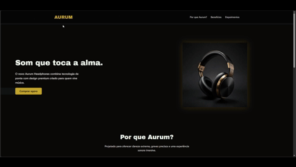

# 🎧 [Aurum Headphones](https://aurum-landing-ebon.vercel.app/)

Landing page fictícia com HTML5 e CSS3, focada em design premim, semântica correta e responsividade. O projeto simula a página oficial de um produto de áudio de alto padrão, com visual moderno em tons dourado, preto e cinza.

🔗 **Objetivo do projeto**: demonstrar domínio de estrutura HTML, organização de CSS, responsividade e atenção a UI/UX.

---

## ✨ Preview



---

## 🧠 O que o projeto faz:

- Apresenta um produto fictício (Aurum Headphones)
- Destaca diferenciais e benefícios
- Exibe depoimentos de clientes
- Possui chamada para ação (CTA)
- Inclui animações leves para experriência premium

---

## 🛠️ Tecnologias utilizadas:

- HTML5 (semântico)
- CSS3
  - Flexbox
  - Grid Layout
  - Media Queries
  - Animações e transições
- Google Fonts (Geom e Archivo Black)

---

## 📱 Responsividade 

O layuot é totalmente reponsivo e se adpata a:

- Desktop
- Tablet
- Mobile

Utilizando abordagem **mobile-first** com breakpoints bem definidos.

---

## 🚀 Como executar o projeto

1. Clone o repositório
```
git clone https://github.com/UelintonHJ/aurum-landing.git
```

2.Abra o arquivo index.html no navegador

---

## 👨‍💻 Autor

Desenvolvido por **Uelinton Janke**
Estudante de Análise e Desenvolvimento de Sistemas
Foco em Front-End

---

⭐ Se você gostou do projeto, dexe uma estrela no repositório!

